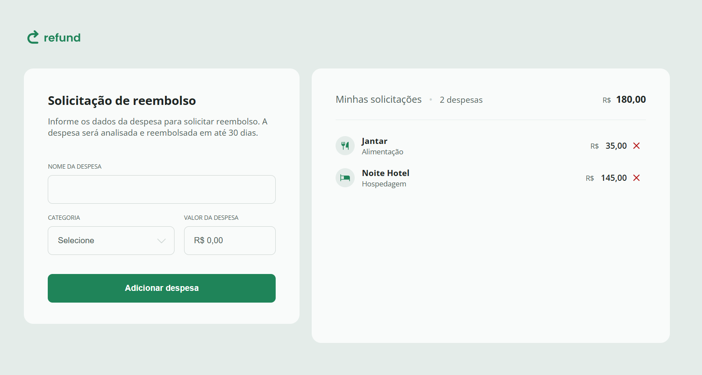

# Refound 💸

Web application for expense reimbursement requests developed with **HTML**, **CSS**, and **Vanilla JavaScript**.  
The project allows users to add expenses, view a dynamic request list, and automatically calculate the total reimbursement amount.

---

## 📌 Features

- ✅ Add new expenses
- ✅ Select expense categories
- ✅ Automatic BRL currency formatting
- ✅ Dynamic expense listing
- ✅ Remove expenses from the list
- ✅ Automatic quantity and total updates
- ✅ Responsive layout
- ✅ Modern and intuitive interface

---

## 🛠️ Technologies Used

- HTML5
- CSS3
- JavaScript (Vanilla JS)

---

# 📸 Preview



The system includes:

- Expense submission form
- Categories with custom icons
- Dynamic expense request list
- Automatic total calculation

---

## 📋 Available Categories

- 🍔 Food
- 🏨 Accommodation
- 🛠️ Services
- 🚗 Transport
- 📦 Others

---

## ⚙️ JavaScript Features

### Currency Formatting

The entered value is automatically converted to Brazilian Real format:

```javascript
value.toLocaleString("pt-BR", {
  style: "currency",
  currency: "BRL",
})
```

---

### Dynamic Expense Creation

Each expense is dynamically created in the DOM:

```javascript
const expenseItem = document.createElement("li")
```

---

### Automatic Total Updates

The system automatically calculates:

- Total number of expenses
- Total reimbursement amount

---

## 📱 Responsiveness

The layout adapts for:

- 💻 Desktop
- 📱 Tablets
- 📲 Smartphones

Using CSS media queries.

---

## 🎯 Project Goal

This project was developed to practice:

- DOM manipulation
- JavaScript events
- Responsive layout structure
- Front-end code organization
- Currency formatting
- Dynamic HTML element creation

---
